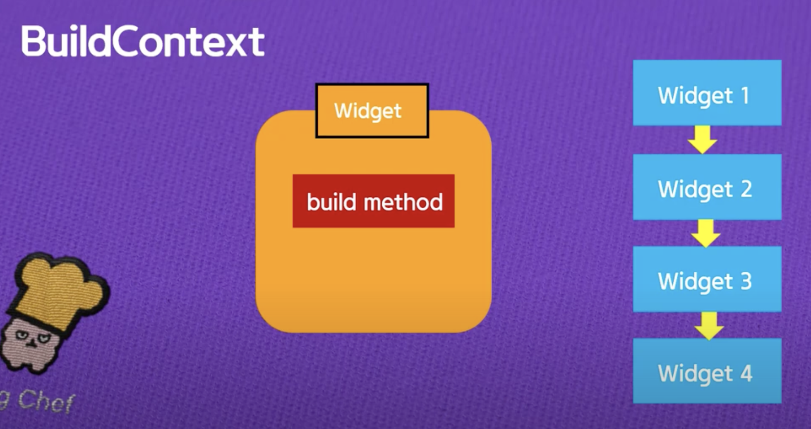
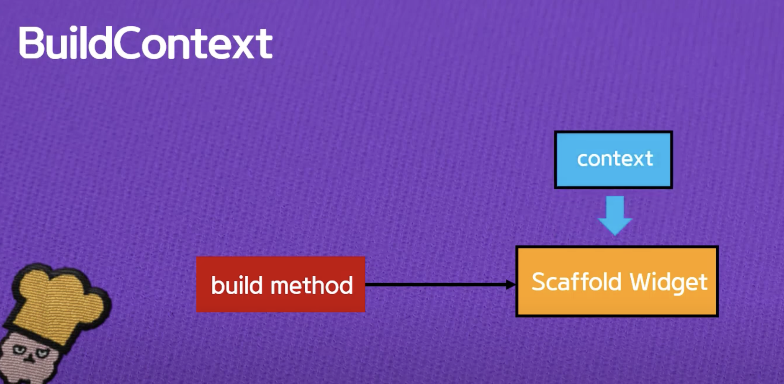
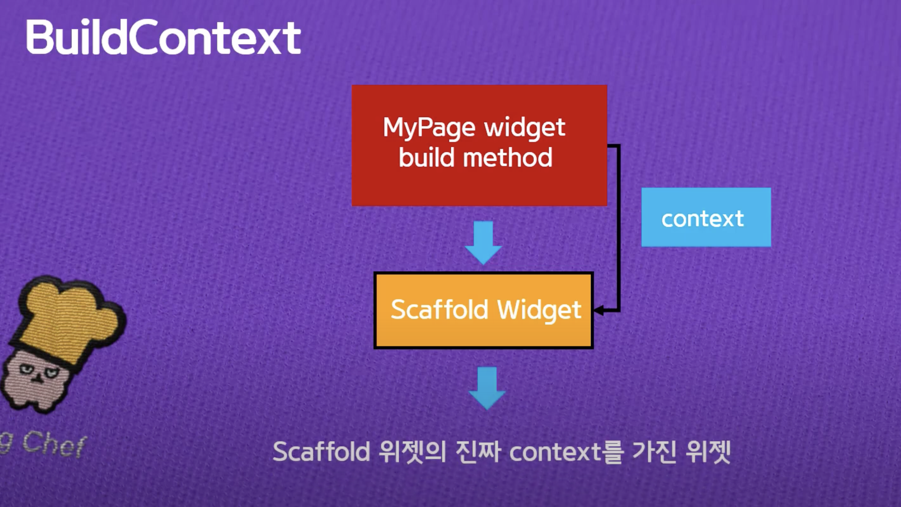

#Flutter 기본 필기 자료

## 17. BuildContext

정의: A handle to the location of a widget in the widget tree
⇒ widget tree에서 현재 widget의 위치를 알 수 있는 정보



```dart
 Widget build(BuildContext context) {
    return Scaffold()
```

build 함수명 앞에 Widget은 타입 build 메소드로 들어오는 인자값은 BuildContext 타입의 context 인자 값 Scaffold를 리턴함



scaffold widget을 리턴하는데, **widget tree상에서 어디에 위치하는가에 대한 정보를 가지고 있는 context**를 넣어서 리턴

BuildContext는 **stateless 위젯이나 state 빌드 메소드에 의해서 리턴된 위젯의 부모**가 됨



build메소드에 의해 리턴된 Scaffold Widget은 그 부모의 buildcontext 타입의 context를 그대로 물려받으니, scaffold widget 밑에서 build로 위젯을 리턴하면 Scaffold위젯의 진짜 context를 물려받을 수 있음


## 22 Navigator

1. Route의 개념
2. Navigator의 정의와 push, pop함수, stack 자료구조
3. MaterialPageRoute 위젯과 context
4. 페이지 이동 기능 구현 완성

flutter는 context와 관련해서 기본적인 페이지 이동이 많이 구현 됨.

- Flutter에서 Route는 단순히 스마트폰에서 보이는 하나의 페이지 또는 activity를 의미
- Navigator는 stack 자료구조로 route를 관리하며, push와 pop 제공